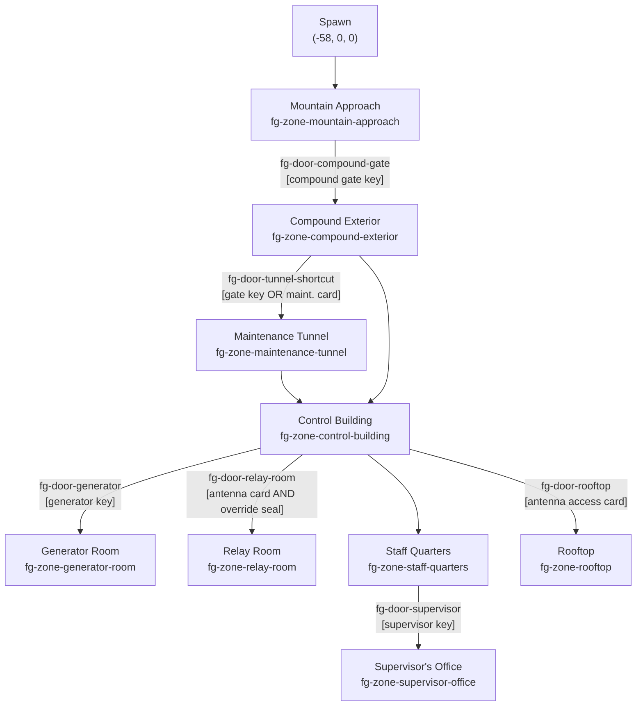
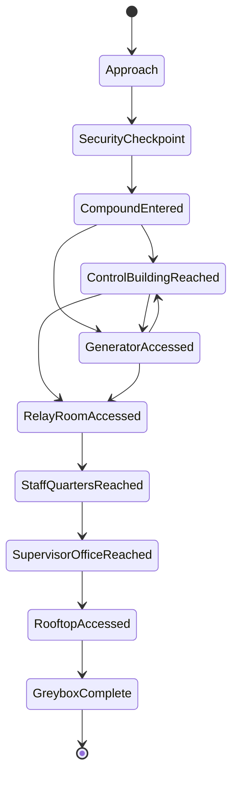

# Facility Topology — Milestone 0.5

Spatial and access relationships between zones, doors and key items.

## Zone connectivity diagram



## Progression phase graph



## Key item dependency tree

```
fg-compound-gate-key  ──→  fg-door-compound-gate  ──→  Compound Exterior
                      ──→  fg-door-tunnel-shortcut (AnyOf)
fg-maintenance-card   ──→  fg-door-tunnel-shortcut (AnyOf)

fg-generator-key      ──→  fg-door-generator  ──→  Generator Room

fg-antenna-access-card ─┐
                         ├→  fg-door-relay-room (AllOf)  ──→  Relay Room
fg-override-seal      ──┘
fg-antenna-access-card ──→  fg-door-rooftop  ──→  Rooftop

fg-supervisor-key     ──→  fg-door-supervisor  ──→  Supervisor's Office
```

## Override seal consumption

`fg-override-seal` is a stackable consumable. Picking up both
`fg-pickup-override-seal-1` and `fg-pickup-override-seal-2` grants a
quantity of 2. Each use of `fg-door-relay-room` consumes exactly 1 unit.
The second use would consume the second unit (if it has not already been used).

The antenna access card is retained after all uses.
